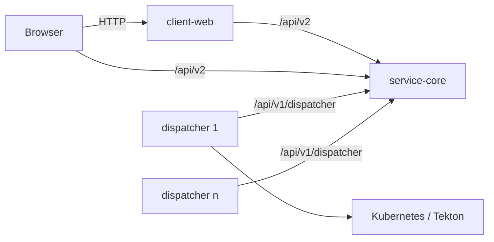

# Boomerang Flow Monorepo

Boomerang Flow is an open-source, cloud-native, low-code/no-code workflow automation platform. Workflows
execute as Directed Acyclic Graphs (DAGs). Apache-2.0 licensed.

This repository holds the whole product — services, migrations, and the web application.

| Module | Role |
|---|---|
| [`service-core`](./service-core) | The deployable: v2 REST API, auth/authz, workspaces, workflows, **and** the DAG execution engine. Runs as `flow.mode = standalone \| engine`. |
| [`service-dispatcher`](./service-dispatcher) | Pluggable execution worker. Per-task runtime behind the `io.boomerang.executor.TaskExecutor` SPI, selected by `agent.executor`: `tekton` (default) or `kube-jobs`. Additional runtimes can be added. |
| [`service-loader`](./service-loader) | Flamingock migrations and bootstrap seeding, run as a pre-deploy Job. |
| [`lib-common`](./lib-common) | Shared domain model, entities, enums, error handling. |
| [`client-web`](./client-web) | The web application — React 18 + React Router 7 (framework mode, SSR) + IBM Carbon v11. Its own image; served only in `standalone` mode. |
| [`e2e`](./e2e) | Playwright end-to-end suite. Drives the real UI against a real backend, so it lives at the repo root rather than under `client-web`. |



`service-flow` and `service-engine` were separate deployables in v4 and are now merged into `service-core`.
The dispatchers pull work from `service-core` and report back over `/api/v1/dispatcher/**`; the engine never
calls a dispatcher.

## Prerequisites

1. **Java 25** — check this first if Maven fails. The default `java` on a dev machine is often still 21, and
   Maven then reports `class file version 69.0 ... only recognizes ... up to 65.0`, which reads like a code
   error but is purely a toolchain mismatch.
   ```bash
   export JAVA_HOME=$(/usr/libexec/java_home -v 25)   # macOS; verify with: java -version
   ```
2. Spring Boot 4.1
3. Maven
4. Node + pnpm (for `client-web`)
5. Docker (for the local stack and the Testcontainers-backed tests)

## Running the whole product locally

`docker-compose.yml` brings up MongoDB, the one-shot `service-loader` migration/seed job (gated so
`service-core` never boots against an unmigrated database), `service-core`, `client-web`, and an nginx
gateway that puts the webapp and the API behind one origin.

`service-dispatcher` is deliberately **not** in the stack — it drives Tekton on a real Kubernetes cluster.

Published `boomerangio/*` images are the v4 line and will not match this branch, so build locally:

```bash
mvn -pl service-core,service-loader -am clean package -DskipTests
cd client-web && pnpm install && pnpm run build && cd ..
docker compose up --build
```

| Surface | URL |
|---|---|
| Unified origin (use this for manual testing and E2E) | http://localhost:8080 |
| `service-core` direct | http://localhost:7700 |
| `client-web` direct | http://localhost:3000 |

Security is off in this stack (`FLOW_SECURITY_ENABLED=false`). That is deliberate and temporary — there is
no login flow yet, so a secured stack would show a blank page.

### End-to-end tests

```bash
cd e2e && npm ci && npx playwright test    # requires the compose stack above to be up
```

### Developing a single service

```bash
mvn clean install                                   # build everything
mvn -pl service-core -am spring-boot:run            # run the API + engine
cd client-web && pnpm start                         # run the webapp with hot reload
```

## Packaging and releases

One product tag builds the whole compatible image set — there is no per-service version line. Tags match
`5.x.y`, optionally with a `-beta.N` or `-rc.N` suffix:

```
5.0.0
5.1.0-beta.3
```

Use the `/release` skill. An SBOM/CVE pipeline exists (`.github/workflows/sbom.yml`, `/cve-review` skill).

## Design details

### Parameters and results

Modelled on Tekton params and results. Tekton requires a spec for a JSON object before you can reference
child elements; Flow does not — the path after `params.<param-name>` is taken as given.

### Execution model

Work is claimed atomically with `findAndModify` — there are no distributed locks. Contended state
transitions use a status Compare-And-Set rather than optimistic-locking retries, and crash recovery is a
set of level-triggered sweeps in `WorkflowWatcher` that any instance can run. The `acquirelock` and
`releaselock` task types use the `task_locks` collection.

### Indexes

MongoDB index creation is owned entirely by `service-loader` changeunits. Entity `@Indexed` and
`@CompoundIndex` annotations are **inert** — `spring.data.mongodb.auto-index-creation=false` — so an
annotation without a matching changeunit creates no index.

## Error handling

All API errors use `io.boomerang.common.error.RestErrorResponse`:

| Field | Description |
|---|---|
| timestamp | UTC timestamp of when the error occurred |
| code | unique identifier (int) for handling errors programmatically |
| reason | unique identifier (string) for searching for more information |
| message | a description intended for a human end user |
| status | HTTP status code and message |
| cause | present only when `flow.error.include-cause=true` |

```json
{
  "timestamp": "2023-01-31T00:15:12.672+00:00",
  "code": 1001,
  "reason": "QUERY_INVALID_FILTERS",
  "message": "Invalid query filters(status) have been provided.",
  "status": "400 BAD_REQUEST",
  "cause": null
}
```

Known codes are indexed in `io.boomerang.common.error.BoomerangError`, with the message text in
`messages.properties`. A custom exception can be thrown instead, at the cost of localisation.

## Feature flags

### Security

Security is toggled by `flow.security.enabled`. Its default derives from `flow.mode` — `standalone` enables
it, `engine` disables it — unless set explicitly. These classes load conditionally:

| Class | Loaded when |
|---|---|
| `AuthenticationFilter` | true |
| `SecurityInterceptorConfiguration` (and so `SecurityInterceptor`) | true |
| `SecurityConfiguration` | true |
| `SecurityDisabledConfiguration` | false |

### Quotas

`flow.quotas.enabled` gates workspace quota enforcement, defaulting from `flow.mode` the same way — on for
`standalone`, off for `engine`, where there is no workspace to scope a quota to.

## History

The v3 → v4 rewrite of the engine is documented in:

- [Model changes and v3 to v4 model comparison](https://github.com/boomerang-io/roadmap/issues/368)
- [Distributed async architecture change](https://github.com/boomerang-io/architecture/tree/feat-v4)
